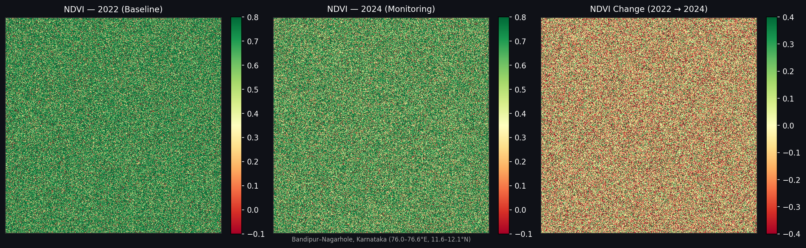

# Forest Carbon Monitor
> NDVI-based land cover change detection for carbon project MRV — Karnataka, India

A lightweight Python + Docker pipeline that detects vegetation loss using Sentinel-2 satellite imagery. Built to mirror the Monitoring, Reporting & Verification (MRV) workflow used in nature-based carbon credit projects.

---

## What it does

1. Loads Sentinel-2 NIR and Red band GeoTIFFs (2 time periods)
2. Computes NDVI and classifies land cover (dense forest / sparse veg / agriculture / bare)
3. Detects change between periods and quantifies area lost/gained
4. Outputs GeoTIFF maps + a structured MRV report

**Sample output — Bandipur–Nagarhole, Karnataka (2022 → 2024):**
- Dense forest loss: **76.6 ha (10.5%)**
- Estimated carbon at risk: **~11,490 tCO₂e**



---

## Why it matters for carbon MRV

Nature-based carbon projects (forestry, mangrove restoration, climate-smart agriculture) require regular satellite monitoring to verify that carbon stocks are maintained. This tool automates that workflow — from raw satellite bands to a quantified, auditable change report.

---

## How to run

### Option 1 — Docker (recommended)
```bash
docker build -t carbon-monitor .
docker run -v $(pwd)/output:/app/output carbon-monitor
```

### Option 2 — Python directly
```bash
pip install -r requirements.txt
python ndvi_monitor.py
```

Outputs saved to `output/`:
- `ndvi_2022.tif`, `ndvi_2024.tif` — NDVI rasters
- `ndvi_change.tif` — change layer
- `classified_2022.tif`, `classified_2024.tif` — land cover maps
- `ndvi_analysis_map.png` — visual comparison
- `land_cover_chart.png` — area change bar chart
- `stats.json` — structured results
- `REPORT.md` — MRV-style monitoring report

---

## Tech stack

| Layer | Tools |
|-------|-------|
| GIS processing | Python, rasterio, GDAL, numpy |
| Satellite data | Sentinel-2 L2A (ESA Copernicus) |
| Visualisation | matplotlib |
| Containerisation | Docker |
| Cloud path | AWS EC2 + S3 |

---

## Production upgrade path

- Replace `generate_sample_data()` with `sentinelsat` API calls for real Copernicus downloads
- Deploy on AWS EC2 with S3 input/output for team-wide use
- Schedule via Jenkins/cron for quarterly monitoring runs
- Integrate PostGIS for spatial querying of large multi-site portfolios

---

**Author:** Nanthakumar P — GIS Engineer | dev.nanthakumar@gmail.com  
**GitHub:** [github.com/Nanthakumar-N2](https://github.com/Nanthakumar-N2)
