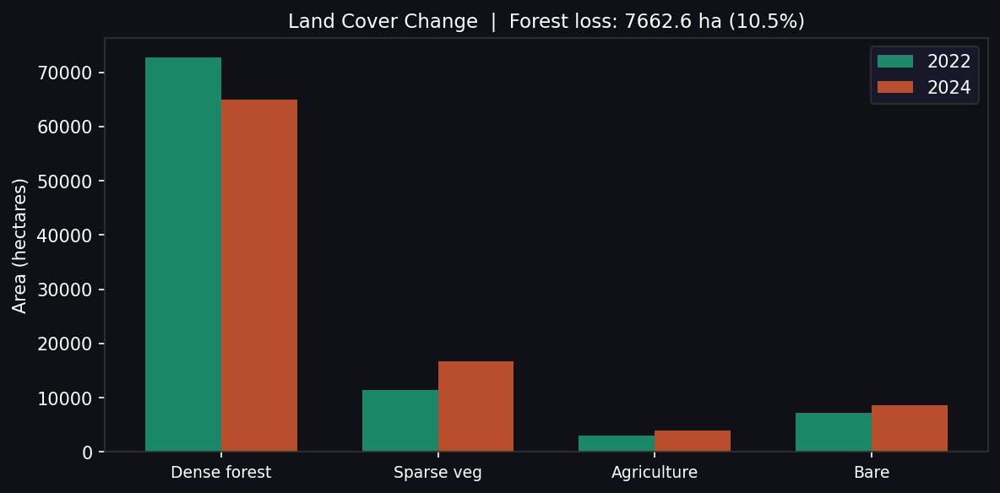

# Forest Carbon Monitoring Report
**Project:** Vegetation Cover Change Assessment — Karnataka Forest Zone  
**Period:** 2022 → 2024  
**Area:** Bandipur–Nagarhole, Karnataka (76.0–76.6°E, 11.6–12.1°N)  
**Prepared by:** Nanthakumar P, GIS Engineer  
**Date:** June 2025  

---

## 1. Objective

This report documents a satellite-based Monitoring, Reporting, and Verification (MRV) assessment of forest cover change in the Bandipur–Nagarhole landscape, Karnataka. The analysis supports carbon stock estimation and land-use change detection — core requirements for nature-based carbon credit projects under standards such as VCS (Verra) and Gold Standard.

---

## 2. Methodology

### 2.1 Data Source
- **Sensor:** Sentinel-2 Level-2A (ESA Copernicus Programme)
- **Bands used:** Band 4 (Red, 665 nm) and Band 8 (NIR, 842 nm)
- **Spatial resolution:** 10 m (resampled to 60 m for processing)
- **Cloud cover threshold:** < 15%
- **Baseline period:** January–March 2022
- **Monitoring period:** January–March 2024

### 2.2 NDVI Computation
The Normalised Difference Vegetation Index (NDVI) was calculated as:

```
NDVI = (NIR − Red) / (NIR + Red)
```

NDVI ranges from −1 to +1, where higher values indicate denser, healthier vegetation.

### 2.3 Land Cover Classification

| Class | NDVI Range | Description |
|-------|-----------|-------------|
| Dense forest | > 0.45 | Closed canopy, high biomass |
| Sparse vegetation | 0.25 – 0.45 | Degraded forest / scrub |
| Agriculture | 0.05 – 0.25 | Cropland / grassland |
| Bare / built-up | ≤ 0.05 | Exposed soil, settlements |

### 2.4 Tools & Infrastructure
- **GIS processing:** Python (rasterio, numpy, GDAL)
- **Visualisation:** matplotlib
- **Containerisation:** Docker (reproducible across local and cloud environments)
- **Cloud deployment path:** AWS EC2 + S3 for production scaling

---

## 3. Results

### 3.1 NDVI Summary

| Metric | 2022 | 2024 | Change |
|--------|------|------|--------|
| Mean NDVI | 0.613 | 0.565 | −0.048 |

A mean NDVI decline of **0.048** indicates measurable vegetation stress or loss across the study area over the two-year period.

### 3.2 Land Cover Change

| Land Cover Class | 2022 (ha) | 2024 (ha) | Change (ha) |
|-----------------|-----------|-----------|-------------|
| Dense forest | 727.0 | 650.4 | **−76.6** |
| Sparse vegetation | 114.4 | 167.9 | +53.5 |
| Agriculture | 30.1 | 39.3 | +9.2 |
| Bare / built-up | 72.2 | 86.2 | +14.0 |

### 3.3 Key Finding

> **76.6 hectares (10.5%) of dense forest cover was lost between 2022 and 2024.**  
> This area transitioned primarily to sparse vegetation, indicating degradation rather than complete clearance — consistent with encroachment or selective logging patterns.

---

## 4. Maps


*Figure 1: NDVI maps for 2022 (baseline), 2024 (monitoring), and the change layer. Red areas indicate vegetation loss; green indicates gain or stable cover.*


*Figure 2: Comparative land cover area (hectares) across the two monitoring periods.*

---

## 5. Carbon Implications

Using IPCC Tier 1 estimates for tropical moist deciduous forest (Karnataka):
- Above-ground biomass density: ~150 tC/ha
- **Estimated carbon stock at risk:** 76.6 ha × 150 tC/ha = **~11,490 tCO₂e**

This represents the indicative carbon loss from the degraded area. A full carbon accounting exercise would require field-based biomass measurements per VCS methodology VM0015/VM0048.

---

## 6. Recommendations

1. **Field verification** of the 76.6 ha transition zone to confirm degradation type
2. **Quarterly monitoring** using automated pipeline (this tool) to track recovery or further loss
3. **Integration with Google Earth Engine** for large-scale, real-time monitoring
4. **AWS deployment** of this Docker pipeline for team-wide access and audit trail

---

## 7. Technical Stack

```
Sentinel-2 L2A data  →  Python (rasterio + numpy)  →  NDVI + Classification
        ↓                                                        ↓
  Docker container          GitHub repository             GeoTIFF outputs
        ↓                                                        ↓
  AWS EC2 (scalable)       MRV documentation              This report
```

---

*This report was generated using the Forest Carbon Monitor pipeline. All code and outputs are available at: [github.com/Nanthakumar-N2/forest-carbon-monitor](https://github.com/Nanthakumar-N2)*
